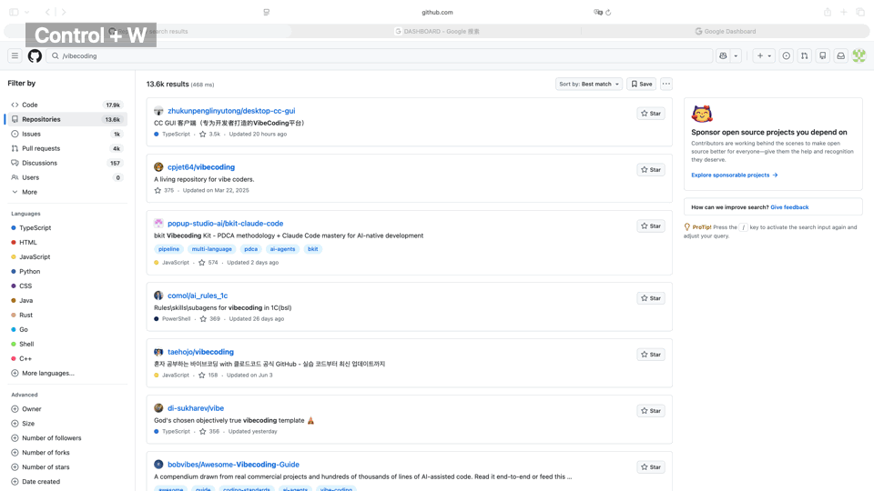

# FocusLens

Live presentation spotlight for macOS.

面向现场演示、远程会议共享和 live demo 的实时聚焦放大工具。



FocusLens is not a post-production zoom tool for recorded videos, and it is not a generic system magnifier. It is built for live presentation, live demo, and live meeting scenarios where presenters need to quickly select, zoom, and visually spotlight an important area while they are speaking.

FocusLens 不是录屏后的后期放大工具，也不是普通屏幕放大镜。它面向 live presentation、远程会议共享和现场 demo，帮助演示者快速框选并放大关键区域，同时用蒙版、边框和水印形成专业的视觉聚焦效果。

The project is currently an MVP. The recommended development and testing path is `swift run`, not the packaged `.app`, because packaged app signing and Screen Recording permissions still need to be stabilized.

## Features

- Start focus mode with `Control + W`.
- Select a region on the screen containing the mouse.
- Zoom the selected region with a dark mask around it.
- Exit with `Esc`.
- Works on the main display and external displays in the current MVP test path.
- No realtime screen stream; FocusLens uses a static screenshot for each focus session.
- Configurable mask opacity, blur, feather strength, zoom, shortcut, and border styling.
- Border styles:
  - Solid
  - Breathing highlight
  - Rainbow gradient
  - Rainbow flow

## Product Positioning

FocusLens fills a gap in live presentation workflows. Many tools focus on automatic zooming after screen recording, or provide general-purpose screen magnification. In real presentations, remote meetings, teaching sessions, and product demos, speakers often need a temporary, fast, and elegant way to enlarge one area so the audience can immediately focus.

FocusLens 的目标是补上 live presentation 场景里的空白。很多工具解决的是录屏后的自动放大，或者系统级通用屏幕缩放。但在真实演示、远程会议共享和现场 demo 中，演示者经常需要临时、快速、优雅地放大某个区域，让观众立即聚焦。

## Requirements

- macOS 13 or later.
- Swift toolchain / Xcode Command Line Tools.
- Screen Recording permission for the terminal app used to run FocusLens.

## Run the MVP

```sh
cd "/Users/xuanmu/Desktop/Mywork/all kind of test/FocusLensMacMVP"
swift run FocusLensMacMVP
```

Keep the terminal process running, then press:

```text
Control + W
```

If FocusLens is already active, pressing `Control + W` again does nothing. Press `Esc` to exit, then press `Control + W` again to start a new focus session.

## Screen Recording Permission

macOS requires Screen Recording permission for screenshot-based tools.

For MVP development, grant permission to the terminal app you use to run `swift run`, such as Terminal or iTerm:

```text
System Settings -> Privacy & Security -> Screen Recording
```

Packaged `.app` builds use a different permission identity. Until signing is stabilized, prefer the `swift run` path for development and testing.

## Settings

Open the FocusLens menu bar icon and choose `Settings...`.

Available settings:

- Mask opacity
- Background blur
- Feather strength
- Max zoom
- Border opacity
- Border color
- Border style
- Shortcut recorder

For rainbow border styles, `Border color` is intentionally disabled because those styles use generated rainbow colors.

## Current MVP Notes

The current MVP intentionally uses `CGWindowListCreateImage` as the primary screenshot path because it successfully captures real windows on both the main screen and external display in the current test environment.

`ScreenCaptureKit` remains in the codebase, but it previously produced wallpaper-only captures when packaged-app permissions were unstable. See:

```text
docs/MVP_SCRIPT_TEST_NOTES.md
```

## Build a Local App Bundle

```sh
./scripts/build_app.sh
open dist/FocusLens.app
```

This creates:

```text
dist/FocusLens.app
```

The local app bundle is intended for development only. For sharing with non-technical users, it should be signed and notarized.

## Release Notes for Future Distribution

To distribute FocusLens smoothly outside the Mac App Store, use:

```text
Developer ID signing + Apple notarization
```

Unsigned or ad-hoc signed builds may trigger macOS security warnings and may require users to manually approve Screen Recording permission again after rebuilds.

## Repository Hygiene

Do not commit:

- `.build/`
- `dist/`
- `.local-signing/`
- `.DS_Store`
- credentials, passwords, signing keys, or notarization profiles

## License

MIT License. See `LICENSE`.
